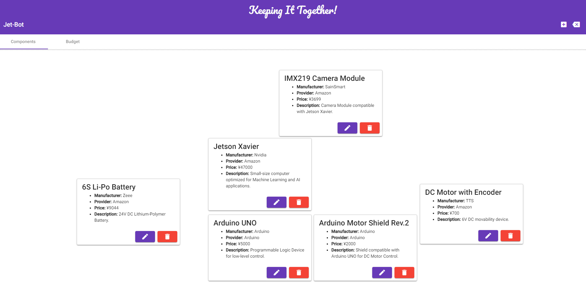

# Keeping It Together 🗃️

Ever lost track of the parts you were using when building something? Despair no more! This project manager application will help you keeping record of your components and the investment you have been doing so far. So let's all **Keep It Together!** 



This project is the first version of my Solo MVP created during my time as a student at Code Chrysalis. It is a full-stack application that uses the following technologies:

- **Front-End:** Angular 12.2.8 and Angular Material library.
- **Back-End:** PostgreSQL Database with Prisma and Express server.
- **Deployment:** Heroku and Firebase.

## Building 🔨

This repository has a `master` branch where all the code is merged, and from here you can install all the dependencies with:

```jsx
npm install
```

However, the front-end and back-end are separated into `app-staging` and `api-staging` branches. Each of those branches has their own set of scripts for development and for deployment.

- **api-staging**
    - Requires a local PostgreSQL Database.
    - `npm run hack:api` : Starts the server with `Nodemon` for development.
    - `npm run migrate` : Creates and applies migrations to the database.
    - `npm run reset` : Resets the local database.
- **app-staging:**
    - `npm run hack:start` : Serves the Angular application in development mode.
    - `npm run hack:build` : Builds the application for production.
    - `npm run hack:watch` : Builds the application for development.

## Deployment 📤

- **Heroku:** Deploys the API. Our Heroku application has the `api-staging` branch linked for automatic deployments. It also has a `Heroku PostgreSQL` database.
- **Firebase:** Deploys the Angular application. Create a new project on `Firebase` and follow the prompts after running:
    
    ```jsx
    ng deploy
    ```